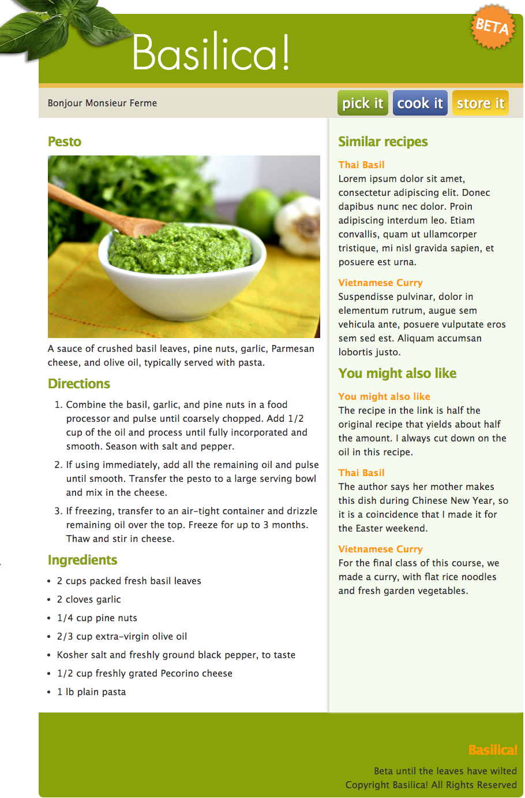

# 1. Basilica!

- [1. Basilica!](#1-basilica)
  - [1.2. Homework](#12-homework)
  - [1.3. Reading](#13-reading)
  - [1.4. Goals](#14-goals)
  - [1.5. Initialize GIT with .gitignore](#15-initialize-git-with-gitignore)
  - [1.6. NPM Initialization and Installs](#16-npm-initialization-and-installs)
  - [1.7. Basilica Project](#17-basilica-project)
    - [1.7.1. Starter CSS](#171-starter-css)
  - [1.8. Responsive Images](#18-responsive-images)
  - [1.9. Flex Layout](#19-flex-layout)
    - [1.9.1. Review: Pseudo-elements vs Pseudo-classes](#191-review-pseudo-elements-vs-pseudo-classes)
  - [1.10. The Branding Header](#110-the-branding-header)
    - [1.10.1. Header: Responsive Design](#1101-header-responsive-design)
  - [1.11. Navigation](#111-navigation)
    - [1.11.1. Button and Gradients](#1111-button-and-gradients)
  - [1.12. CSS Grid](#112-css-grid)
  - [1.13. Sass](#113-sass)
    - [1.13.1. SASS Variables](#1131-sass-variables)
    - [1.13.2. SASS Nesting](#1132-sass-nesting)
    - [1.13.3. SASS Partials](#1133-sass-partials)
    - [1.13.4. A Note on Refactoring](#1134-a-note-on-refactoring)
  - [1.14. JavaScript](#114-javascript)
    - [1.14.1. Aside: Demo Arrays in Node](#1141-aside-demo-arrays-in-node)
    - [1.14.2. Add a Script](#1142-add-a-script)
  - [1.15. JavaScript Popover](#115-javascript-popover)
  - [1.16. DOM Scripting Methods Used](#116-dom-scripting-methods-used)
    - [1.16.1. matches](#1161-matches)
    - [1.16.2. Add Another Close Method](#1162-add-another-close-method)
  - [1.17. A Dynamic Popover](#117-a-dynamic-popover)
  - [1.18. Notes](#118-notes)
  - [1.19. Expressions](#119-expressions)
  - [1.20. Statements](#120-statements)

## 1.2. Homework

Create separate popovers for each button in the navigations. The popovers should each have different messages.

## 1.3. Reading

- See how far you can get in [Grid Garden](http://cssgridgarden.com/)
- MDN on [CSS Grid](https://developer.mozilla.org/en-US/docs/Web/CSS/CSS_Grid_Layout)
- The [Absolute Beginners Guide](https://nodesource.com/blog/an-absolute-beginners-guide-to-using-npm/) to NPM
- [What is GIT?](https://guides.github.com/introduction/git-handbook/)

## 1.4. Goals

- Review GIT and Github set up and branching
- Review NPM set up and installing
- Continue working with Flexbox and introduce CSS Grids
- Understand and set up a CSS toolchain using SASS
- Review basic DOM manipulation techiques
- Understand how to create an element and insert it into the DOM

## 1.5. Initialize GIT with .gitignore

```sh
$ git init
$ git add .
$ git commit -m 'initial commit'
```

Create a branch:

```sh
$ git branch inclass
$ git checkout inclass
$ touch .gitignore // edit to include 'node_modules'
```

Create a branch in VS Code and merge it back into another.

Log into [Github](http://github.com) and create a new repo.

Follow the instructions to create a remote and push the master branch and inclass branch to the remote.

## 1.6. NPM Initialization and Installs

- Create a manifest (package.json)
- Install a package
- set up a gitignore

```bash
$ npm init
$ npm install browser-sync sass concurrently --save-dev
```

Note:

- sass, concurrently
- package.json
- package-lock.json
- dependencies
- node_modules folder
- why the need for `.gitignore`?

Browser Sync [CLI documentation](https://www.browsersync.io/docs/command-line)

```js
"scripts": {
  "start": "browser-sync start --directory --server 'app' --files 'app'",
},
```

Remember, if the repo comes with a package.json file (aka 'manifest') run `npm install` to install.

In the terminal:

`$ npm run start`

## 1.7. Basilica Project



Open `app/index.html` in VS Code and examine the HTML with regards to the [recipe schema](https://schema.org/Recipe) at [schema.org](http://schema.org/docs/gs.html).

Here is an [article that addresses the recipe schemas](https://www.foodbloggerpro.com/blog/article/what-is-recipe-schema/) but note that there are [many different kinds](https://schema.org/docs/full.html).

Have a look at a sample [recipe](https://www.allrecipes.com/recipe/20144/banana-banana-bread/) and note the schema in the inspector.

Note the `<abbr>` tag and the absence of a wrapper div (even though the design shows a centered document).

### 1.7.1. Starter CSS

Examine the starter CSS. Note the use of `max-width` on the body selector - we applied these to a div in the past.

Note `li > h4` selector. It is used to select elements with a _specific parent_. In this case it will select `h4` tags _only_ when they are proceeded by an `li`.

Here's a [complete listing](https://developer.mozilla.org/en-US/docs/Web/CSS/Reference#Combinators) of selector types in CSS.

Note the [css variables](https://developer.mozilla.org/en-US/docs/Web/CSS/--*):

```css
html {
  --basil-green: #88a308;
  --dark-gray: #333333;
  --light-gray: #e4e1d1;
  --light-green: #f5faef;
  --orange: #f90;
  --light-orange: #ebbd4e;
  --red: #f00;
  --max-width: 840px;
  --breakpoint: 640px;
}
```

CSS variables are applied as follows:

```css
<property>: var(--<variable-name>);
```

For example:

```css
color: var(--basil-green);
```

Note also: the transition property on the anchor selector. This is a shortcut for:

```css
transition-property: color;
transition-duration: 1s;
transition-timing-function: linear;
```

or `transition: color 0.2s linear;`

Confine this effect to anchors within the content div.

Replace the generic hover with:

```css
.content a:hover {
  color: var(--basil-green);
}
```

## 1.8. Responsive Images

[Responsive Images](https://developer.mozilla.org/en-US/docs/Learn/HTML/Multimedia_and_embedding/Responsive_images) are a critical component of responsive design:

```css
img {
  width: 100%;
  height: auto;
}
```

You should always use `width: 100%` on images (and videos).

Replace the lone img tag in the HTML with `figure` and `figcaption` tags:

```html
<figure>
  
  <figcaption>
    Classic, simple basil pesto recipe with fresh basil leaves, pine nuts,
    garlic, Romano or Parmesan cheese, extra virgin olive oil, and salt and
    pepper.
  </figcaption>
</figure>
```

A `<figure>` is an image, illustration, or diagram that is referenced in the main flow of a document, but that can be moved to another part of the document without affecting the main flow.

We want to display identical image content, just larger or smaller depending on the device. The standard `` element only lets you point the browser to a single source file. We will use two new attributes — `srcset` and `sizes` — to provide additional source images along with hints to help the browser pick the right one.

- Upload `pesto.jpg` to a generator such as [responsivebreakpoints.com](https://www.responsivebreakpoints.com/). Download the zip file and place the unzipped folder in the `img` directory.

Replace the `img` tag in index.html with a [picture tag](https://developer.mozilla.org/en-US/docs/Web/HTML/Element/picture):

```html
<picture>
  
</picture>
```

`srcset` defines the set of images we will allow the browser to choose between, and what size each image is.

It consists of:

1. Am image path / filename
2. A space
3. The image's inherent width (real size) in pixels using a `w` unit (not `px`).

`sizes` defines a set of media conditions (e.g. screen widths) and indicates what image size would be best to choose, when certain media conditions are true. In this case, before each comma we write:

1. A media condition e.g. `(max-width:480px)` - here "when the viewport width is 480 pixels or less"
1. A space
1. The width of the slot the image will fill when the media condition is true (440px.). You can get this from the inspector by inspecting the image at a variety of screen widths.

The browser ignores everything after the first matching condition, so be careful how you order the media conditions.

With these attributes in place, the browser will:

1. Look at its device width.
1. Work out which media condition in the sizes list is the first one to be true.
1. Look at the slot size given to that media query.
1. Load the image referenced in the `srcset` list that most closely matches the chosen slot size.

Using this technique can save a lot of bandwidth. Older browsers that don't support these features will just ignore them, and go ahead and load the image referenced in the `src` attribute.

You can check the results of your work by viewing the Network tab in the inspector and noting which image was downloaded at a variety of screen sizes.

The `<picture>` tag can be used for cropping or modifying images for different media conditions _or_ offering different image formats when certain formats are not supported by all browsers. See the [example](https://developer.mozilla.org/en-US/docs/Web/HTML/Element/picture) on MDN.

You need a server to output multiple mage sizes and formats. There are specialized services such as Cloudinary available. At a bare minimum, should also run your images through a processor such as imageOptim.

```html


```

## 1.9. Flex Layout

The two column view applies only to widescreen.

We will make the article and aside run side by side by applying flex to their parent container within a mobile first breakpoint:

```css
@media (min-width: 640px) {
  .content {
    display: flex;
  }
}
```

Note: we _cannot_ use a CSS variable as a breakpoint:

```css
@media (min-width: var(--breakpoint)) {
}
```

A media query is not an element selector so it does not inherit styles.

We can use the flex property on the flex children to manipulate the columns:

```css
@media (min-width: 640px) {
  .content {
    display: flex;
  }
  article {
    flex: 1 0 60%;
  }
}
```

The [flex property](https://css-tricks.com/snippets/css/a-guide-to-flexbox/) is used on flex children only. We are using a shortcut here which includes `flex-grow, flex-shrink, and flex-basis`. Default is `Default is 0 1 auto`.

Here is the long form:

```css
article {
  flex-grow: 1;
  flex-shrink: 0;
  flex-basis: 60%;
}
```

Use a background color and box-shadow to color the aside:

```css
@media (min-width: 640px) {
  .content {
    display: flex;
  }
  article {
    flex: 1 0 60%;
  }
  aside {
    background: var(--light-green);
    box-shadow: -4px 0px 4px #ddd;
  }
}
```

Add some padding to the two columns outside the media query so it applies to both large and small screens:

```css
article,
aside {
  padding: 1rem;
}
```

Format the footer;

```css
footer {
  background-color: var(--basil-green);
  padding: 1rem;
  border-radius: 0 0 4px 4px;
  margin-bottom: 2rem;
}
```

### 1.9.1. Review: Pseudo-elements vs Pseudo-classes

```txt
Pseudo-elements:    Pseudo-classes:
::first-letter      :hover
::first-line        :visited
::before            :link
::after             :active
::selection         :target
                    :focus
```

Some [ideas](https://css-tricks.com/pseudo-element-roundup/) for using pseudo-elements.

e.g.: Selected text:

```css
::selection {
  background: var(--basil-green);
  color: #fff;
}
```

## 1.10. The Branding Header

Add the green background to the branding div.

```css
header {
  height: 120px;
  background: var(--basil-green);
  border-radius: 8px 8px 0px 0px;
}
```

Note: this is one of the rare occasions that we will use the height property. We use it here because the header does not contain dynamic content.

Add the custom font (top of the css file):

```css
@import url(futura/stylesheet.css);
```

Note - To convert fonts to web formats see [Font Squirrel](https://www.fontsquirrel.com/tools/webfont-generator). This requires an additional call to the server to fetch the additional css when the browser renders the file.

```css
header h1 {
  background: url(img/basil.png) no-repeat;
  font-family: FuturaStdLight, sans-serif;
  font-weight: normal;
  color: #fff;
  font-size: 5rem;
}
```

Note: when using custom fonts like this `font-weight: normal;` is necessary because by default header tags like h1 are bold and we do not have a bold version of the font here.

The background image is 272px by 170px.

Since background images fill the container we can manipulate it using padding:

```css
header h1 {
  padding-left: 260px;
  padding-top: 90px;
  ...;
}
```

We cannot see the text because we have added padding. Use transform to tweak the positioning:

```css
header h1 {
  transform: translateX(-100px);
  transform: translateY(-80px);
  ...;
}
```

Note the transform in the inspector - there is an error.

We have to use this format:

```css
header h1 {
  transform: translate(-100px, -80px);
  ...;
}
```

Note: transforms are an [important property](https://developer.mozilla.org/en-US/docs/Web/CSS/CSS_Transforms), especially when it comes to creating animations. We'll create an example now.

Note the beta link in the header:

```html
<header>
  <h1>Basilica!</h1>
  <a class="beta" href="#">Beta</a>
</header>
```

Absolutely position the beta element (we can do this in the context of the header because we apply `position: relative` to it earlier).

```css
header a.beta {
  background: url('img/burst.svg') no-repeat;
  color: #fff;
  font-size: 1.5rem;
  position: absolute;
  top: -20px;
  right: 10px;
  width: 85px;
  height: 85px;
  line-height: 85px;
  text-align: center;
  text-transform: uppercase;
}
```

Note: the use of `img/burst.svg` for the background image. Examine the it in the editor.

Note: the use of line-height to set the leading to the same height as the containing element. This allows the text to vertically center.

Note the use of position absolute. We will give this element a positioning context by applying position absolute to its containing element:

```css
header {
  position: relative;
  ...;
}
```

Add a hover, transform and animate:

```css
header a.beta {
  transform: rotate(20deg);
  transition: all 1s ease;
  ...;
}
```

```css
header a.beta:hover {
  transform: rotate(0deg) scale(1.2);
}
```

### 1.10.1. Header: Responsive Design

Examine the site for problems in a narrow browser.

We will attempt a mobile first design strategy. Edit the css to display for small screen first:

```css
header h1 {
  background: url(img/basil.png) no-repeat;
  font-family: FuturaStdLight, sans-serif;
  font-weight: normal;
  color: #fff;
  font-size: 5rem;
}
```

And add features for the large screen within a media query:

```css
@media (min-width: 640px) {
  header h1 {
    padding-left: 240px;
    padding-top: 90px;
    transform: translate(-100px, -80px);
    background-position: top left;
  }
  ...;
}
```

Additional tweaks for the small screen might include:

- Removing the body margin top (and adding it back for the wide screen):

```css
body {
  font: 100%/1.5 'Segoe UI', Candara, 'Bitstream Vera Sans', 'DejaVu Sans', 'Bitstream Vera Sans',
    'Trebuchet MS', Verdana, 'Verdana Ref', sans-serif;
  color: var(--dark-gray);
  max-width: var(--max-width);
  /* margin: 0 auto;
  margin-top: 24px; */
}
```

```css
@media (min-width: 640px) {
  body {
    margin: 0 auto;
    margin-top: 24px;
  }
  ...;
}
```

- Removing the rounded corners on small screen (and adding it back on wide screens):

```css
header {
  position: relative;
  height: 120px;
  background: var(--basil-green);
  /* border-radius: 8px 8px 0px 0px; */
}
```

```css
@media (min-width: 640px) {
  header {
    border-radius: 8px 8px 0px 0px;
  }
  ...;
}
```

Remember: there is no hover in touch screen devices.

## 1.11. Navigation

Add the code below one rule at a time:

```css
nav {
  background: var(--light-gray);
  border-top: 0.5rem solid var(--light-orange);
  padding: 0.5rem;
  display: flex;
  align-items: center;
}

nav ul {
  display: flex;
}

nav li {
  list-style: none;
  margin-right: 0.5rem;
}

nav p {
  margin-right: auto;
}
```

Note the margin-right property on the paragraph and the effect it has on the positioning on the navigation links.

Remove it and add `justify-content` to the flex parent:

```css
nav {
  justify-content: space-between;
  flex-wrap: wrap;
  ...;
}
/* nav p {
  margin-right: auto; 
} */
```

Note: the flex-wrap property allows the paragraph to stack on small screens.

### 1.11.1. Button and Gradients

```css
nav a {
  text-align: center;
  font-size: 1.5rem;
  padding: 8px;
  color: #fff;
  text-shadow: 1px 1px 3px rgba(0, 0, 0, 0.5);
  border-radius: 6px;
}
```

The [gradients](http://www.colorzilla.com/gradient-editor/) for the buttons:

```css
.nav-storeit a {
  background: linear-gradient(to bottom, #fcde41 1%, #dfa910 100%);
}

.nav-storeit a:hover {
  background: linear-gradient(to bottom, #dfa910 0%, #fcde41 100%);
}

.nav-pickit a {
  background: linear-gradient(to bottom, #abc841 0%, #6b861e 100%);
}

.nav-pickit a:hover {
  background: linear-gradient(to bottom, #6b861e 1%, #abc841 100%);
}

.nav-cookit a {
  background: linear-gradient(to bottom, #6f89c7 0%, #344e8b 100%);
}

.nav-cookit a:hover {
  background: linear-gradient(to bottom, #344e8b 1%, #6f89c7 100%);
}
```

Make all the buttons the same width. Try with and without the `inline-block`.

```css
nav a {
  min-width: 120px;
  display: inline-block;
  ...;
}
```

Note: this is a setting which will likely need to be changed to accomodate small screens.

## 1.12. CSS Grid

CSS Tricks offers a [guide to CSS grid](https://css-tricks.com/snippets/css/complete-guide-grid/).

Flexbox operates in a [single dimension](https://hackernoon.com/the-ultimate-css-battle-grid-vs-flexbox-d40da0449faf): x or y. CSS Grid operates on both the x _and_ y axis.

Our current use of Flexbox to style the content columns operates in a single (horizontal or x) dimension so flex is a viable option.

Nevertheless, we will use CSS Grid for the primary layout in order to introduce some of its features in this simple use case.

Remove the flex statements and use a grid display, define columns, and set the start and end points for the grid children:

```css
@media (min-width: 640px) {
  .content {
    /* display: flex; */
    display: grid;
    grid-template-columns: 20% 20% 20% 20% 20%;
  }
  article {
    grid-column-start: 1;
    grid-column-end: span 3;
    /* flex: 1 0 60%; */
  }
  aside {
    grid-column-start: 4;
    grid-column-end: span 2;
    background: var(--light-green);
    box-shadow: -4px 0px 4px #ddd;
  }
  ...;
}
```

Finally, by moving using display grid to the body selector, we can use [grid areas](https://developer.mozilla.org/en-US/docs/Web/CSS/grid-template-areas) to define our layout:

```css
@media (min-width: 600px) {
  body {
    margin: 0 auto;
    margin-top: 1.5rem;
    display: grid;
    grid-template-areas:
      'header'
      'nav'
      'content'
      'footer';
  }
  header {
    border-radius: 8px 8px 0px 0px;
    grid-area: header;
  }
  header h1 {
    padding-left: 240px;
    padding-top: 90px;
    transform: translate(-100px, -80px);
    background-position: top left;
  }
  nav {
    grid-area: nav;
  }
  .content {
    grid-area: content;
    display: grid;
    grid-template-columns: repeat(5, 1fr);
    grid-column-gap: 1rem;
  }
  article {
    grid-column: span 3;
  }
  aside {
    grid-column: span 2;
    background: var(--light-green);
    box-shadow: -4px 0px 4px #ddd;
  }
  footer {
    grid-area: footer;
  }
}
```

Demo:

```css
header {
  grid-area: footer;
}
```

There is a complete CSS file available at [this gist](https://gist.github.com/DannyBoyNYC/4e0065e7b1f542c67a13899f0541bdb6)

## 1.13. Sass

Examine [this branch](https://github.com/front-end-foundations/Basilica/tree/sass-done) on the repo.
Note the `scss` folder and its contents.

Earlier we used NPM to install [Sass](https://www.npmjs.com/package/sass):

`npm install sass --save-dev`

Stop the server and add a script to package.json for processing:

```js
"scripts": {
  ...
  "sass": "sass  scss/styles.scss app/css/styles.css --watch --source-map"
},
```

Dart Sass CLI [documentation](https://sass-lang.com/documentation/file.SASS_REFERENCE.html)

To run both scripts at the same time edit the scripts in package.json:

```js
  "scripts": {
    "server": "browser-sync start --directory --server 'app' --files 'app'",
    "sass": "sass  scss/styles.scss app/css/styles.css --watch --source-map",
    "start": "npm run server & npm run sass"
  },
```

1. Create a `scss` folder at the top level of our repo
1. Copy `styles.css` into it
1. Rename `scss/styles.css` to `scss/styles.scss`.

Run `npm start` (note: the word 'run' is optional when using start).

Test it by re-adding the following to the top of `styles.scss`:

```css
* {
  color: red !important;
}
```

Note that sass is less tolerant of errors than regular css. Try

`* { color red !important };`.

### 1.13.1. SASS Variables

Sass has its own variables system, e.g.:

```css
$basil-green: #88a308;
$breakpoint-med: 640px;
```

Here is an example showing sass variables for breakpoints and more:

Example:

```css
$break-five: 81.25em;
// 1300px
$break-four: 71.25em;
// 1140
$break-three: 61.25em;
// 980
$break-two: 46.25em;
// 760
$break-one: 22.5em;
// 360

$radius: 0.25rem;

$fonts: 'Source Sans Pro', Helvetica, Clean, sans-serif;

$red: #f00;
```

Usage example:

```css
$red: #f00;
* {
  color: $red !important;
}
```

Add the sample SASS variables to a new file in a new folder `scss/imports/_variables.scss` and include it at the top of `styles.scss`:

```css
@import 'imports/variables';
```

Note the syntax differences between a native CSS import as well as the underscore in the file name. We will come back to that later.

Test using the `$red` variable. Try changing it. Remove it.

### 1.13.2. SASS Nesting

Sass will let you nest your CSS selectors in a way that mirrors the hierarchy of your HTML. Be aware that overly nested rules will result in over-qualified CSS that could prove hard to maintain and is generally considered bad practice.

Nest the header related styles in `styles.scss`:

```css
header {
  position: relative;
  height: 120px;
  background: var(--basil-green);

  h1 {
    background: url(img/basil.png) no-repeat;
    font-family: FuturaStdLight, sans-serif;
    font-weight: normal;
    color: #fff;
    font-size: 5rem;
  }
  a.beta {
    background: url('img/burst.svg') no-repeat;
    color: #fff;
    font-size: 1.5rem;
    position: absolute;
    top: -20px;
    right: 10px;
    width: 85px;
    height: 85px;
    line-height: 85px;
    text-align: center;
    text-transform: uppercase;
    transform: rotate(20deg);
    transition: all 1s ease;
  }
  a.beta:hover {
    transform: rotate(0deg) scale(1.2);
  }
}
```

### 1.13.3. SASS Partials

Sass partials allow you to create separate function or feature specific style sheets using [imports](https://sass-lang.com/guide#topic-4) and helps maintain a large code base.

Examples [Bootstrap](https://getbootstrap.com) and its [SASS roots](https://github.com/twbs/bootstrap-sass)

Create `imports/_header.scss` and cut and paste the nested header material from `_styles.scss` into it. Import it to the main stylesheet with:

```css
@import 'imports/header';
```

Note the underscore in the file name. If you add an underscore to the start of the file name, Sass won’t compile it. So, if you don’t want `header.scss` to compile to `header.css`, name the file with an undercore `_header.scss` instead. Files used this way are called partials in Sass.

Note: SASS allows you to use JavaScript style comments - `//`. These comments do not get compiled into the css file. Traditional CSS comments ( `/* ... */` ) do.

Create a nested block for the nav in styles.scss:

```css
nav {
  background: var(--light-gray);
  border-top: 0.5rem solid var(--light-orange);
  padding: 0.5rem;
  display: flex;
  align-items: center;
  justify-content: space-between;
  flex-wrap: wrap;

  ul {
    display: flex;
  }

  li {
    list-style: none;
    margin-right: 0.5rem;
  }

  a {
    text-align: center;
    font-size: 1.5rem;
    padding: 8px;
    color: #fff;
    text-shadow: 1px 1px 3px rgba(0, 0, 0, 0.5);
    border-radius: 6px;
    min-width: 120px;
    display: inline-block;
  }

  .nav-storeit a {
    background: linear-gradient(to bottom, #fcde41 1%, #dfa910 100%);
  }

  .nav-storeit a:hover {
    background: linear-gradient(to bottom, #dfa910 0%, #fcde41 100%);
  }

  .nav-pickit a {
    background: linear-gradient(to bottom, #abc841 0%, #6b861e 100%);
  }

  .nav-pickit a:hover {
    background: linear-gradient(to bottom, #6b861e 1%, #abc841 100%);
  }

  .nav-cookit a {
    background: linear-gradient(to bottom, #6f89c7 0%, #344e8b 100%);
  }

  .nav-cookit a:hover {
    background: linear-gradient(to bottom, #344e8b 1%, #6f89c7 100%);
  }
}
```

Create a partial `_nav.scss` in the imports folder and cut and paste the nested nav block into it. Import the partial back into `styles.scss` with:

`@import 'imports/nav';`

Examine the CSS in the browser's inspector. Note the mapping.

One of the best things about nesting in SASS is how it allows you to organize media queries and keep them aligned with the selector.

Cut the body rule from the breakpoint and add the styling to the initial body rule as shown:

```css
body {
  font: 100%/1.5 'Segoe UI', Candara, 'Bitstream Vera Sans', 'DejaVu Sans', 'Bitstream Vera Sans',
    'Trebuchet MS', Verdana, 'Verdana Ref', sans-serif;
  color: var(--dark-gray);
  max-width: var(--max-width);
  @media (min-width: $break-two) {
    margin: 0 auto;
    margin-top: 1.5rem;
    display: grid;
    grid-template-areas:
      'header'
      'nav'
      'content'
      'footer';
  }
}
```

Note: since SASS is a transpiler we can use SASS variables - `$break-two` - for break points.

Perform a similar action for the header partial use nesting for the media queries:

```css
header {
  position: relative;
  height: 120px;
  background: var(--basil-green);

  @media (min-width: $break-two) {
    border-radius: 8px 8px 0px 0px;
    grid-area: header;
  }

  h1 {
    background: url(img/basil.png) no-repeat;
    font-family: FuturaStdLight, sans-serif;
    font-weight: normal;
    color: #fff;
    font-size: 5rem;

    @media (min-width: $break-two) {
      padding-left: 240px;
      padding-top: 90px;
      transform: translate(-100px, -80px);
      background-position: top left;
    }
  }
  ...;
}
```

- Add it to the imports folder and import it back into `styles.scss` with:

`@import 'imports/header';`

Nest the media query for the nav:

```css
nav {
  background: var(--light-gray);
  border-top: 0.5rem solid var(--light-orange);
  padding: 0.5rem;
  display: flex;
  align-items: center;
  justify-content: space-between;
  flex-wrap: wrap;

  @media (min-width: $break-two) {
    grid-area: nav;
  }

  ...;
}
```

<!-- Copy and Paste -->

Finally, create partials `_base.scss` and `_content.scss`.

In `_base.scss`:

```css
@import url(futura/stylesheet.css);

html {
  --basil-green: #88a308;
  --dark-gray: #333333;
  --light-gray: #e4e1d1;
  --light-green: #f5faef;
  --orange: #f90;
  --light-orange: #ebbd4e;
  --red: #f00;
  --max-width: 840px;
  --breakpoint: 640px;
}

* {
  margin: 0;
  padding: 0;
}

::selection {
  background: var(--basil-green);
  color: #fff;
}

body {
  font: 100%/1.5 'Segoe UI', Candara, 'Bitstream Vera Sans', 'DejaVu Sans', 'Bitstream Vera Sans',
    'Trebuchet MS', Verdana, 'Verdana Ref', sans-serif;
  color: var(--dark-gray);
  max-width: var(--max-width);
  @media (min-width: $break-two) {
    margin: 0 auto;
    margin-top: 1.5rem;
    display: grid;
    grid-template-areas:
      'header'
      'nav'
      'content'
      'footer';
  }
}

h2,
h3 {
  color: var(--basil-green);
  margin: 8px 0;
  font-size: 1.4rem;
  letter-spacing: -1px;
}

h2 {
  font-size: 2rem;
}

a {
  color: var(--orange);
  text-decoration: none;
  transition: color 0.5s linear;
}

li > h4 {
  margin-top: 12px;
}

img {
  width: 100%;
  height: auto;
}
```

In `_content.scss`

```css
.content {
  @media (min-width: $break-two) {
    grid-area: content;
    display: grid;
    grid-template-columns: repeat(5, 1fr);
    grid-column-gap: 1rem;
  }
  a:hover {
    color: var(--basil-green);
  }
}

article {
  padding: 1rem;
  @media (min-width: $break-two) {
    grid-column: span 3;
  }
  li {
    margin-left: 1rem;
    margin-bottom: 0.5rem;
  }
  ol {
    margin-left: 1rem;
    margin-bottom: 0.5rem;
  }
  figcaption {
    font-size: 0.75rem;
  }
}

aside {
  padding: 1rem;
  @media (min-width: $break-two) {
    grid-column: span 2;
    background: var(--light-green);
    box-shadow: -4px 0px 4px #ddd;
  }
  li {
    list-style: none;
    margin-left: 1rem;
    margin-bottom: 0.5rem;
  }
}

footer {
  background-color: var(--basil-green);
  padding: 1rem;
  border-radius: 0 0 4px 4px;
  margin-bottom: 2rem;
  @media (min-width: $break-two) {
    grid-area: footer;
  }
}
```

And in `styles.scss` all you should need is:

```css
@import 'imports/variables';
@import 'imports/base';
@import 'imports/header';
@import 'imports/nav';
@import 'imports/content';
```

Test in the browser at various sizes.

Note that we get a horizontal scrollbar at a 375px width. This is due to the size of the navigation buttons.

Try changing them in `_nav.scss`:

```css
a {
  text-align: center;
  font-size: 1.5rem;
  padding: 8px;
  min-width: 90px;
  color: #fff;
  text-shadow: 1px 1px 3px rgba(0, 0, 0, 0.5);
  border-radius: 6px;
  display: inline-block;
  @media (min-width: $break-two) {
    min-width: 120px;
  }
}
```

Note: switching branches at this point will delete styles.css from the css directory. Stop the processes running in the console before switching branches.

Finally, copy the font css into a new partial and change the paths:

```css
@font-face {
  font-family: 'FuturaStdLight';
  src: url('futura/futurastd-light-webfont.eot');
  src: url('futura/futurastd-light-webfont.eot?#iefix') format('embedded-opentype'),
    url('futura/futurastd-light-webfont.woff') format('woff'),
    url('futura/futurastd-light-webfont.ttf') format('truetype'), url('futura/futurastd-light-webfont.svg#FuturaStdLight')
      format('svg');
  font-weight: normal;
  font-style: normal;
}
```

### 1.13.4. A Note on Refactoring

Once you have everything visually working and start using your template with live data you typically find issues with the design.

Note `index.js` in the `js` folder and link it to `index.html`:

```html
<script src="js/index.js"></script>
```

```js
var API = 'https://ron-swanson-quotes.herokuapp.com/v2/quotes'

fetch(API)
  .then(function (response) {
    return response.json()
  })
  .then(function (data) {
    document.querySelector('.quote').innerText = data[0]
  })
```

Add class "quote" to the lone paragraph in the navigation. Use `aria-live="polite"`

## 1.14. JavaScript

Let's ease into JavaScript with a demonstration and a simple DOM manipulation.

### 1.14.1. Aside: Demo Arrays in Node

Review Node:

```sh
$ mkdir node
$ cd node
$ touch basilnode.js
$ npm init -y
$ npm install random-number
```

[Random Number](https://www.npmjs.com/package/random-number) on npmjs.com.

In `basilnode.js`:

```js
const randomNumber = require('random-number')

const randomIndex = randomNumber({
  min: 0,
  max: 4,
  integer: true,
})

console.log(randomIndex)
console.log(typeof randomNumber)
console.log(typeof randomIndex)
```

At the command line:

```sh
$ node basilnode.js
```

Add some additional variables - arrays:

```js
const randomNumber = require('random-number')

const basilChef = ['mama', 'papa', 'baby']

function randomItem(array) {
  const randomIndex = randomNumber({
    min: 0,
    max: array.length - 1,
    integer: true,
  })
  return array[randomIndex]
}

console.log(basilChef)
console.log(basilChef[0])
console.log(basilChef.length)
console.log(randomItem(basilChef))
```

```sh
$ node basilnode.js
```

Call the randomItem function from within another function and use a [template string](https://developer.mozilla.org/en-US/docs/Web/JavaScript/Reference/Template_literals) to construct a bit of HTML::

```js
const randomNumber = require('random-number')

const basilChef = ['mama', 'papa', 'baby']
const basilTexture = ['greasy', 'frozen', 'spicy']

function randomItem(array) {
  const randomIndex = randomNumber({
    min: 0,
    max: array.length - 1,
    integer: true,
  })
  return array[randomIndex]
}

function makeBasil() {
  return `<h2>${randomItem(basilChef)}'s ${randomItem(basilTexture)} basil</h2>`
}

console.log(makeBasil())
```

### 1.14.2. Add a Script

We'll do something similar to the node demo above in our app - replacing the recipe title with a random one.

In `index.js`:

Evolve a function that uses JavaScript's built-in [Math methods](https://developer.mozilla.org/en-US/docs/Web/JavaScript/Reference/Global_Objects/Math) to return a random number between zero and two:

```js
function random() {
  const max = 3
  // const randomIndex = Math.random();
  // const randomIndex = Math.random() * max;
  const randomIndex = Math.floor(Math.random() * max)
  return randomIndex
}

console.log(random())
```

Now call our random function passing in an array.

```js
const basilChefs = ['mama', 'papa', 'baby']

function random(array) {
  const max = array.length
  const randomIndex = Math.floor(Math.random() * max)
  return array[randomIndex]
}

var name = random(basilChefs)
console.log(name)
```

We used the random number to select a name from the array and return it to the calling function.

Add another variable `basilTexture` and massage the output to product a string:

```js
const basilChefs = ['mama', 'papa', 'baby']
const basilTexture = ['greasy', 'frozen', 'spicy']

function random(array) {
  const max = array.length
  const randomIndex = Math.floor(Math.random() * max)
  return array[randomIndex]
}

var recipeName =
  'My ' + random(basilChefs) + "'s " + random(basilTexture) + ' pesto'
console.log(recipeName)
```

Let's use the return value in our layout:

```js
const el = document.querySelector('h2')
```

Test `el` in the console.

```js
const el = document.querySelector('h2')

const basilChefs = ['mama', 'papa', 'baby']
const basilTexture = ['greasy', 'frozen', 'spicy']

function random(array) {
  const max = array.length
  const randomIndex = Math.floor(Math.random() * max)
  return array[randomIndex]
}

var recipeName = `${random(basilChefs)}'s ${random(basilTexture)} pesto`

el.innerHTML = recipeName
```

and format it in `_base.scss`:

```css
h2 {
  font-size: 2rem;
  text-transform: capitalize;
}
```

## 1.15. JavaScript Popover

Create a div on the bottom of the html page (but before the script tag).

```html
<div class="modal">
  <h3>Hi! I'm a Modal Window (ʘ‿ʘ)╯</h3>
  <p>Information about the beta program.</p>
</div>
```

Create `_modal.scss` and add it to `styles.scss` (e.g. `@import 'imports/modal';`):

```css
.modal {
  max-width: 600px;
  min-width: 400px;
  padding: 2rem;
  border-radius: 5px;
  min-height: 200px;
  border: 2px solid var(--orange);
  background: white;
  position: fixed;
  top: 30%;
  left: calc(50% - 150px);
  // display: none;
}
```

Uncomment `display: none` and add a `open` rule:

```css
.open {
  display: block;
}
```

Test by adding the `open` class to the modal using the dev tool's inspector.

Code the `.beta` button to show the window.

Create a variable for the beta button, attach an event listener to it, and create a function to handle the event.

```js
var modal = document.querySelector('.modal')
var betaButton = document.querySelector('.beta')

function showPopover(event) {
  modal.classList.toggle('open')
  event.preventDefault()
}

betaButton.addEventListener('click', showPopover)
```

Refactor to use event delegation:

```js
var modal = document.querySelector('.modal')
// var betaButton = document.querySelector('.beta');

function showPopover(event) {
  console.log(event.target)
  if (!event.target.matches('.beta')) return
  modal.classList.toggle('open')
  event.preventDefault()
}

// betaButton.addEventListener('click', showPopover);
document.addEventListener('click', showPopover)
```

## 1.16. DOM Scripting Methods Used

- Use [querySelector](https://developer.mozilla.org/en-US/docs/Web/API/Document/querySelector) to find the first matching element on a page `var modal = document.querySelector('.modal');`
- Use [querySelectorAll()](https://developer.mozilla.org/en-US/docs/Web/API/ParentNode/querySelectorAll) to find all matching elements on a page
- Use [addEventListener('event', function)](https://developer.mozilla.org/en-US/docs/Web/API/EventTarget/addEventListener), to listen for events on an element. You can find a full list of available events on the [Mozilla Developer Network](https://developer.mozilla.org/en-US/docs/Web/Events)
- Use [Functions](https://developer.mozilla.org/en-US/docs/Glossary/Function) to store and execute your commands
- Use [classList](https://plainjs.com/javascript/attributes/adding-removing-and-testing-for-classes-9/) to add, remove, toggle, list and test for classes

### 1.16.1. matches

The `matches()` method lets you check if an element would be selected by a particular selector. It returns true if the element is a match, and false when it’s not. It can be an alternative to using `element.classList.contains('.someclass')`.

```js
// Match by an ID
if (elem.matches('#first-button')) {
  // Do something...
}

// Match by a class
if (elem.matches('.button-submit')) {
  // Do something...
}

// Match by one of several selectors
// Returns true when element contains at least one of the selectors
if (elem.matches('.click-me, .button-submit')) {
  // Do something...
}
```

### 1.16.2. Add Another Close Method

Add html to the betainfo:

```html
<div class="modal">
  <h3>Hi! I'm a Modal Window (ʘ‿ʘ)╯</h3>
  <p>Information about the beta program.</p>
  <!-- NEW -->
  <a class="closer" href="#0">✖︎</a>
</div>
```

Style it:

```css
.closer {
  position: absolute;
  top: -10px;
  right: -10px;
  width: 1.5rem;
  height: 1.5rem;
  background: #fff;
  color: var(--orange);
  border: 4px solid var(--orange);
  border-radius: 50%;
  text-align: center;
  line-height: 1.5rem;
  cursor: pointer;
}
```

Extend the showPopover function to include the new element script.

```js
var modal = document.querySelector('.modal')

function showPopover(event) {
  if (!event.target.matches('.beta, .closer')) return
  modal.classList.toggle('open')
  event.preventDefault()
}

document.addEventListener('click', showPopover)
```

Note: you cannot animate between `display: none` and `display: block`.

Add a wrapping div - `modal-outer` - around the modal:

```html
<div class="modal-outer">
  <div class="modal">
    <h3>Hi! I'm a Modal Window (ʘ‿ʘ)╯</h3>
    <p>Information about the beta program.</p>
    <a class="closer" href="#0">✖︎</a>
  </div>
</div>
```

Style it:

```css
.modal-outer {
  display: grid;
  background: rgba(0, 0, 0, 0.5);
  position: fixed;
  height: 100vh;
  width: 100vw;
  top: 0;
  left: 0;
  justify-content: center;
  align-items: center;
  /* Hide this until we need it */
  opacity: 0;
  pointer-events: none;
  transition: opacity 0.2s;
}

.modal-outer.open {
  opacity: 1;
  pointer-events: all;
}
```

Try: changing the opacity and pointer-events properties to 1 and all.

Edit the script to select the outer div and apply the `open` class to it:

```js
var modal = document.querySelector('.modal')
var modalOuter = document.querySelector('.modal-outer')

function showPopover(event) {
  if (!event.target.matches('.beta, .closer')) return
  modalOuter.classList.toggle('open')
  event.preventDefault()
}

document.addEventListener('click', showPopover)
```

Now the modal wrapper will show when the button is clicked - but the modal will not.

Edit styles for the interior modal:

```css
.modal {
  max-width: 600px;
  min-width: 400px;
  padding: 2rem;
  border-radius: 5px;
  min-height: 200px;
  border: 2px solid var(--orange);
  background: white;
  transform: translateY(200%);
  transition: transform 1s;
}

.modal-outer.open .modal {
  transform: translateY(0);
}
```

Note that we are no longer using '`display: none` to hide the modal. The inner modal is becoming visible because its container, modal outer, is transitioning opacity.

Edit the script to allow clicking on the overlay to close the modal.

```js
var modalOuter = document.querySelector('.modal-outer')

function showPopover(event) {
  if (event.target.matches('.beta')) {
    modalOuter.classList.add('open')
  } else if (event.target.matches('.closer, .modal-outer')) {
    modalOuter.classList.remove('open')
  } else return
  event.preventDefault()
}

document.addEventListener('click', showPopover)
```

## 1.17. A Dynamic Popover

We will use the popover for different purposes depending on which element is clicked.

```js
var modalOuter = document.querySelector('.modal-outer')
var modalInner = document.querySelector('.modal')

var betaContent = `
<h3>Oooops!</h3>
<p>Wow! Nothing works!<p>
`

function showPopover(event) {
  if (event.target.matches('.beta')) {
    modalInner.innerHTML = betaContent
    modalOuter.classList.add('open')
  } else if (event.target.matches('.closer, .modal-outer')) {
    modalOuter.classList.remove('open')
  } else return
  event.preventDefault()
}

document.addEventListener('click', showPopover)
```

Let's use our new popover to display a different message when the user clicks on any of the three nav buttons.

```js
var modalOuter = document.querySelector('.modal-outer')
var modalInner = document.querySelector('.modal')

var betaContent = `
<h3>Oooops!</h3>
<p>Wow! Nothing works!<p>
`
var buttonContent = `
<h2>Coming Soon</h2>
<p>This feature coming soon.<p>
<a class="closer" href="#0">✖︎</a>
`

function showPopover(event) {
  if (event.target.matches('.beta')) {
    modalInner.innerHTML = betaContent
    modalOuter.classList.add('open')
  } else if (event.target.closest('nav ul')) {
    modalInner.innerHTML = buttonContent
    modalOuter.classList.add('open')
  } else if (event.target.matches('.closer, .modal-outer')) {
    modalOuter.classList.remove('open')
  } else return
  event.preventDefault()
}

document.addEventListener('click', showPopover)
```

Note the use of [closest](https://gomakethings.com/checking-event-target-selectors-with-event-bubbling-in-vanilla-javascript/) above. The `closest()` method looks for the closest matching parent to an element that has a selector that you pass in.

## 1.18. Notes

Template literals allow embedded expressions. You can use multi-line strings and string interpolation features with them. They were called "template strings" in prior editions of the ES2015 specification.

```js
let recipe = `
<figure>
  <picture>
    
  </picture>

  <figcaption>
    Classic, simple basil pesto recipe with fresh basil leaves, pine
    nuts, garlic, Romano or Parmesan cheese, extra virgin olive oil, and
    salt and pepper.
  </figcaption>
</figure>

<h2 itemprop="name">Pesto</h2>

<p itemprop="description">
  A sauce of crushed basil leaves, pine nuts, garlic, Parmesan cheese,
  and olive oil, typically served with pasta.
</p>

<h3>Directions</h3>

<ol itemprop="recipeInstructions">
  <li>
    Combine the basil, garlic, and pine nuts in a food processor and
    pulse until coarsely chopped. Add 1/2 cup of the oil and process
    until fully incorporated and smooth. Season with salt and pepper.
  </li>
  <li>
    If using immediately, add all the remaining oil and pulse until
    smooth. Transfer the pesto to a large serving bowl and mix in the
    cheese.
  </li>
  <li>
    If freezing, transfer to an air-tight container and drizzle
    remaining oil over the top. Freeze for up to 3 months. Thaw and stir
    in cheese.
  </li>
</ol>

<h3>Ingredients</h3>
<ul>
  <li itemprop="recipeIngredient">2 cups packed fresh basil leaves</li>
  <li itemprop="recipeIngredient">2 cloves garlic</li>
  <li itemprop="recipeIngredient">1/4 cup pine nuts</li>
  <li itemprop="recipeIngredient">2/3 cup extra-virgin olive oil</li>
  <li itemprop="recipeIngredient">
    Kosher salt and freshly ground black pepper, to taste
  </li>
  <li itemprop="recipeIngredient">
    1/2 cup freshly grated Pecorino cheese
  </li>
  <li itemprop="recipeIngredient">
    1 <abbr title="Pounds">lb</abbr> plain pasta
  </li>
</ul>
`

const article = document.querySelector('article')
article.innerHTML = recipe
```

## 1.19. Expressions

Any unit of code that can be evaluated to a value is an expression. Since expressions produce values, they can appear anywhere in a program where JavaScript expects a value.

```js
10 + 13
'hello' + 'world'
```

## 1.20. Statements

A statement is an instruction to perform a specific action - creating a variable or a function, looping through an array of elements, and evaluating code based on a specific condition.

```js
var total = 0

function greet(message) {
  console.log(message)
}
```

```js
let dirs = ''

function createDirections() {
  for (let i = 0; i < currRecipe.directions.length; i++) {
    dirs += '<li>' + currRecipe.directions[i] + '</li>'
  }
}

createDirections()
```

```js
${currRecipe.directions.map(dir => {
  `<li>${dir}</li>`;
})}
```

```js
${currRecipe.directions.map(dir => `<li>${dir}</li>`)}
```

```js
${currRecipe.directions.map(dir => `<li>${dir}</li>`).join('')}
```

ONE

```js
const recipeTitle = recipesData[0].name
console.log(recipeTitle)
const figure = document.querySelector('h2')
console.log(figure)
figure.innerText = recipeTitle
```

`<div id="app"></div>`

TWO

```js
const recipe = recipesData[0]
const recipeOne = '<h2 itemprop="name">' + recipe.name + '</h2>'
const app = document.querySelector('#app')
app.innerHTML = recipeOne
```

`<div id="app"></div>`

THREE

```js
const recipe = recipesData[0]
const recipeOne =
  '<h2>' +
  recipe.name +
  '</h2>' +
  '<figure>' +
  '<picture>' +
  '' +
  '</picture>' +
  '<figcaption>' +
  recipe.description +
  '</figcaption>' +
  '</figure>'

const app = document.querySelector('#app')
app.innerHTML = recipeOne
```

FOUR

```js
const recipe = recipesData[0]
const recipeOne = `<h2>${recipe.name}</h2>
  <figure >
  <picture>
    
  </picture>
    <figcaption>${recipe.description}</figcaption>
  </figure>`

console.log(recipeOne)

const app = document.querySelector('#app')
app.innerHTML = recipeOne
```

Concurrently:

```
"start": "concurrently \"npm run sass\" \"npm run server \" "
"start": "npm run server & npm run sass"
```

```js
  "scripts": {
    "server": "browser-sync start --directory --server 'app' --files 'app'",
    "sass": "sass  scss/styles.scss app/css/styles.css --watch --source-map",
    "start": "concurrently \"npm run sass\" \"npm run server\" "
  },
```

https://developer.mozilla.org/en-US/docs/Web/JavaScript/Guide/Modules

```

```
